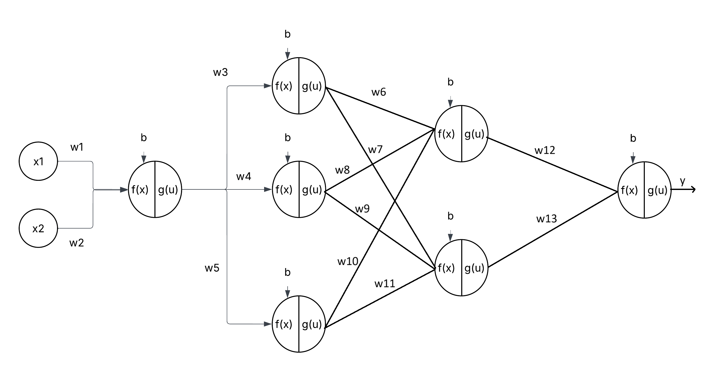

## 🧠 Model Purpose:

This model is a **simple feedforward neural network** (also called a multilayer perceptron or MLP) built using TensorFlow Keras Functional API. It takes a 2-dimensional input and produces a single output using a sigmoid activation function, suitable for **binary classification tasks**.

---

### 📦 Imports:

```python
from tensorflow.keras.layers import Input, Dense
from tensorflow.keras import Model
```

* `Input`: Defines the shape of the input data.
* `Dense`: Fully connected neural network layer.
* `Model`: Used to construct the Keras model from input and output layers.

---

### 🏗️ Model Architecture:

```python
inputs = Input((2,))
```

* Input layer that accepts 2 features (e.g., `[x1, x2]`).
* Shape: `(batch_size, 2)`

```python
h1 = Dense(1, activation='relu')(inputs)
```

* First hidden layer with **1 neuron**.
* Activation: ReLU (Rectified Linear Unit) to introduce non-linearity.

```python
h2 = Dense(3, activation='relu')(h1)
```

* Second hidden layer with **3 neurons**.
* Activation: ReLU.

```python
h3 = Dense(2, activation='relu')(h2)
```

* Third hidden layer with **2 neurons**.
* Activation: ReLU.

```python
outputs = Dense(1, activation='sigmoid')(h3)
```

* Output layer with **1 neuron**.
* Activation: Sigmoid, which outputs a value between 0 and 1—interpreted as a probability.
* Suitable for **binary classification**.

---

### 🧩 Model Compilation:

```python
model = Model(inputs, outputs)
```

* Combines the input and output layers to create a Keras model object.

---

### 📊 Model Summary:

```python
model.summary(show_trainable=True)
```

* Prints a table of all layers, their output shapes, number of parameters, and trainable status.
* `show_trainable=True` highlights which layers are trainable.
---

### 📝 Summary of Parameters:

| Layer       | Output Shape | Params |
| ----------- | ------------ | ------ |
| Dense (h1)  | (None, 1)    | 3      |
| Dense (h2)  | (None, 3)    | 6      |
| Dense (h3)  | (None, 2)    | 8      |
| Dense (out) | (None, 1)    | 3      |
| **Total**   |              | **20** |

* Each `Dense` layer parameter count = `input_dim × units + bias`.

---

### ✅ Use Case:

This model is best used for binary classification tasks where input features are 2-dimensional vectors. Examples:

* Predicting whether a point lies inside a certain region on a 2D plane.
* Classifying binary outcomes based on 2 input variables.

